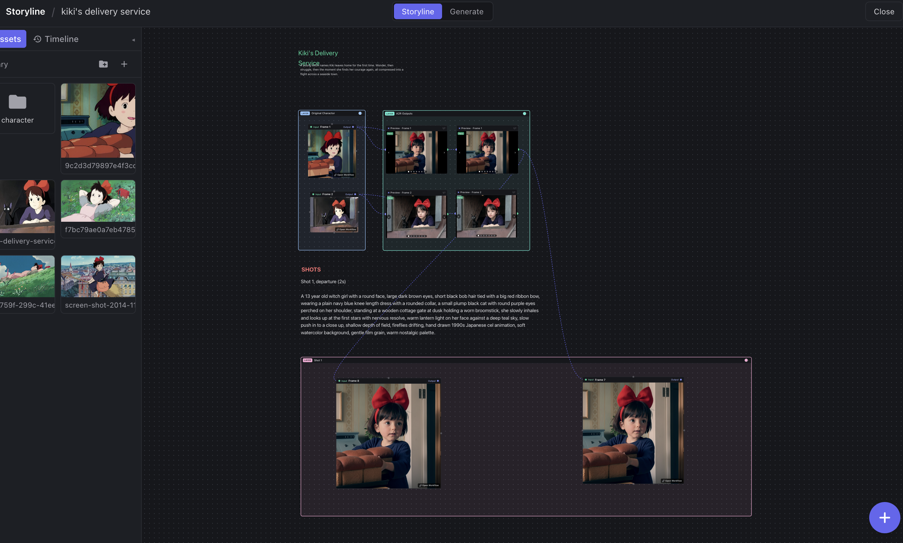

# Storyline

**A narrative-first desktop app for filmmakers, video artists, and visual creators, powered by your own [ComfyUI](https://github.com/comfyanonymous/ComfyUI).**

ComfyUI is the most capable generative engine currently: image, video, audio, LLM, every new model lands there first. But it asks you to think in node graphs and execution order. Filmmakers think in frames, scenes, and sequences. Storyline sits in between: you compose your film on a free-form canvas and work frame by frame, while ComfyUI quietly does the generation behind each one.



> **Status: active development.** The canvas, the project model, and the ComfyUI bridge are working today. Timeline editing, a preview player, and video export are next.

---

## The idea

A **frame is not a file. It's a slot with a history of takes.**

Filmmakers re-shoot. So in Storyline, every render you make becomes an immutable _take_ that lives under its frame. Nothing gets overwritten; you generate again and again, then pick the one that works (the "hero"), and that's the one that flows on to the next shot. That versioned-take history is the thing ComfyUI doesn't give you, and it's what the whole app is built around.

```
Project  →  Sequence  →  Frame  →  Take[]
```

A project is a single portable `.storyline` folder you can move, back up, or hand to a collaborator.

---

## How it feels to use

Everything happens on a **node canvas**. Think of it as a mood board that can actually generate.

- **Drop an asset** onto the canvas to start a frame. Drop several and the frame becomes a little carousel; star the one you want as the hero.
- **Preview a frame's output**, page through its takes, and pick the keeper.
- **Chain frames together**: wire one frame's output into the next frame's input, and the result you chose flows straight through. Refine a shot, then feed it forward. Regenerate the source and everything downstream follows.
- **Arrange freely** with layers, text notes, and connections, the way you'd lay out a board in Figma or Miro. Marquee-select, copy/paste, delete, and undo/redo all work the way your hands expect.

When it's time to generate, the **Generate** tab opens your own ComfyUI right inside the app. Storyline hands it the frame's inputs, wires them into the workflow, and pulls the finished renders back in as takes. The full node graph is always one click away when you want it.

---

## Bring your own ComfyUI

Storyline doesn't bundle or manage ComfyUI; you run it, wherever you like, and point Storyline at it.

- **Running locally with a GPU?** Start ComfyUI with `--enable-cors-header` and paste its address into the Generate tab.
- **No GPU?** Spin up ComfyUI on a cloud GPU (the app walks you through deploying it on [RunPod](https://runpod.io)) and paste the public URL. Any reachable ComfyUI works.

Your media, your models, your machine. Storyline just gives the work a narrative shape.

---

## Getting started

You'll need [Node.js](https://nodejs.org) 20.11+ (22 recommended).

```bash
git clone <this-repo>
cd storyline
npm install      # also rebuilds the native SQLite module for Electron
npm run dev      # launches the app with hot-reload
```

To generate, start ComfyUI with CORS enabled and connect it on the Generate tab:

```bash
python main.py --enable-cors-header     # then paste http://127.0.0.1:8188 in-app
```

> On macOS sandboxes that set `ELECTRON_RUN_AS_NODE=1`, launch with
> `env -u ELECTRON_RUN_AS_NODE npm run dev`.

---

## Building a desktop app

To produce an installer you can hand to someone, package it for your platform:

```bash
npm run package:mac      # .dmg + .zip in dist/  (Apple Silicon + Intel)
npm run package:win      # NSIS .exe installer in dist/
npm run package:linux    # AppImage in dist/
```

A few things to know:

- **Build each OS on its own OS.** Storyline ships a native module (SQLite), which has to be compiled for the target machine. So build the Mac app on a Mac and the Windows app on Windows. The easiest way to get both from one place is CI: run `package:mac` on a macOS runner and `package:win` on a Windows runner.
- **After packaging, `npm run dev` may complain about the native module.** Packaging rebuilds SQLite for the target architecture; run `npm run rebuild` to restore it for local development.
- **The builds are unsigned.** On first launch macOS and Windows will warn about an unidentified developer. On a Mac, right-click the app and choose Open (or remove the quarantine flag with `xattr -dr com.apple.quarantine /Applications/Storyline.app`). For real distribution you'll want code signing and notarization.
- **App icon.** The icon lives in `build/` (`icon.png` is the source). Replace it there and re-package to rebrand.

---

## Contributing

Storyline is early and moving fast, and issues, ideas, and pull requests are all welcome. If you're poking at the code, [CLAUDE.md](CLAUDE.md) is the engineering guide: it explains the architecture, the data model, and the conventions to follow.

Want to help by using it for real? Try the [creator task](task.md): build a short 20-second story in Storyline and send us your feedback.

## License

MIT.
